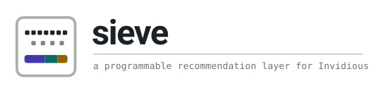
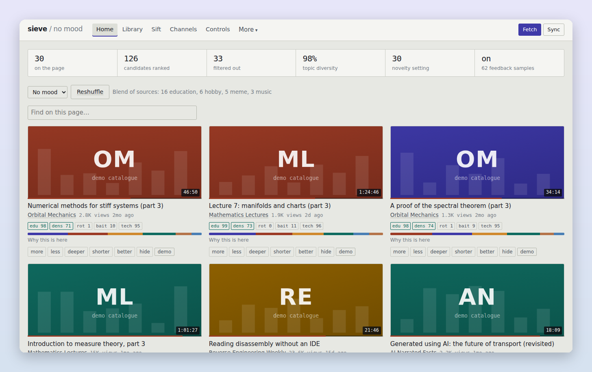
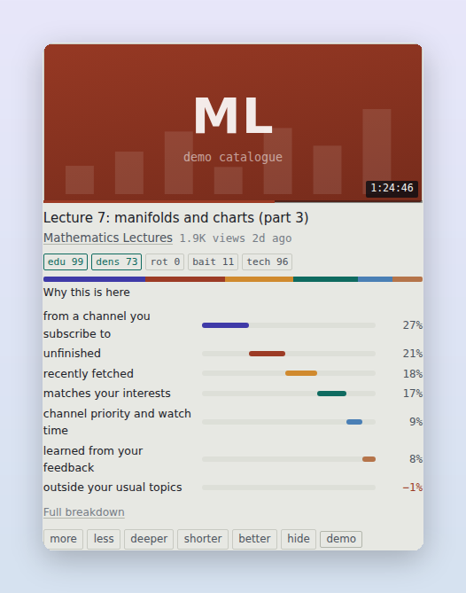
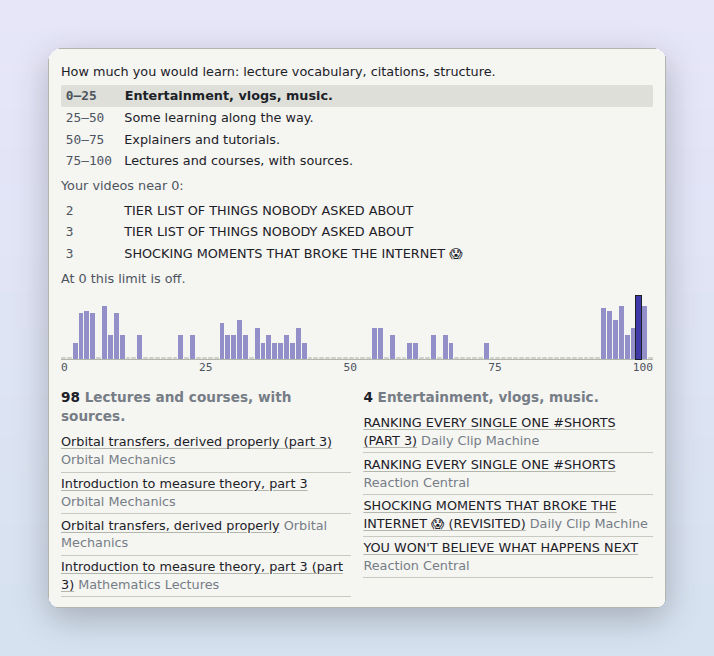
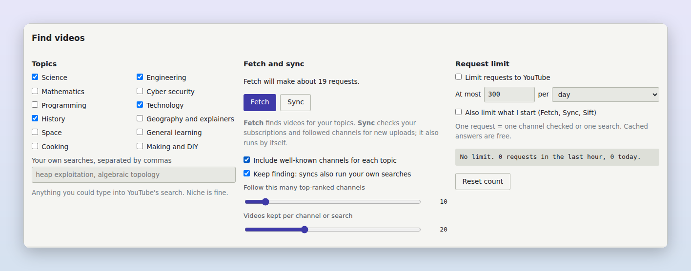
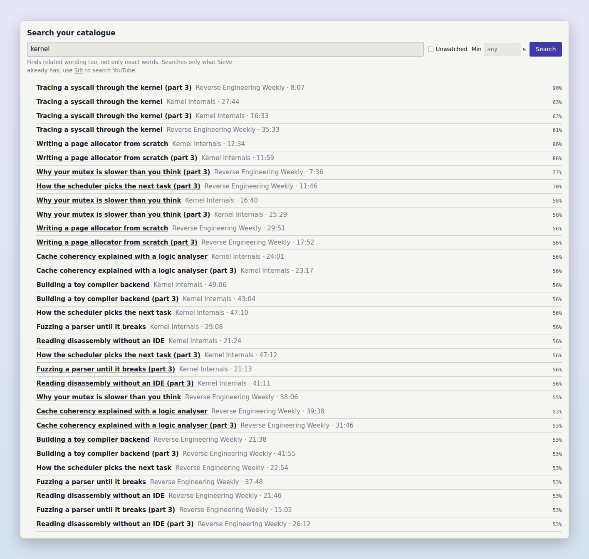
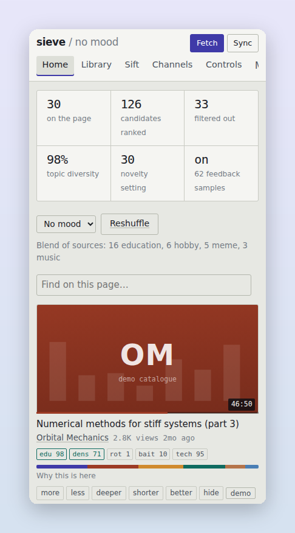
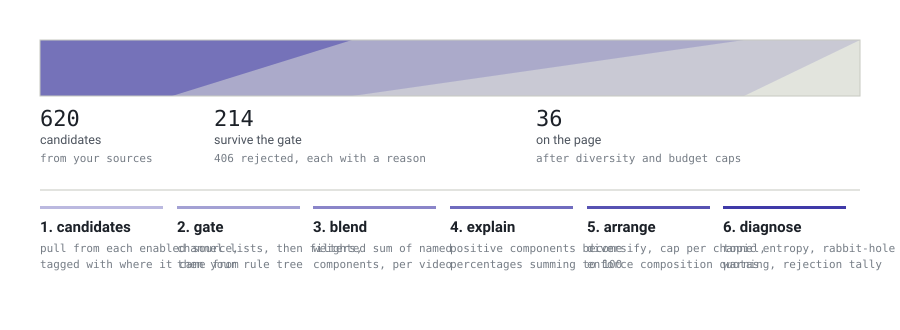

<div align="center">

<picture>
  <source media="(prefers-color-scheme: dark)" srcset="docs/assets/logo-dark.svg">
  
</picture>

**Your own YouTube recommendations — ranked by rules you can see and change.**

[](https://github.com/WhereIsXuezugi/sieve/actions/workflows/ci.yml)
[](https://github.com/WhereIsXuezugi/sieve/actions/workflows/android.yml)


[Quick start](#quick-start) · [Features](#what-it-does) · [Android](#on-android) · [Docs](#documentation) · [Changelog](CHANGELOG.md)

<br>

<picture>
  <source media="(prefers-color-scheme: dark)" srcset="docs/images/home-dark.png">
  
</picture>

</div>

Sieve is a homepage for YouTube that runs on your own computer. It finds videos for
the topics you pick, scores every one of them — how educational, how clickbaity, how
dense — and ranks them by **your** settings, not by what keeps people watching. Every
video says why it is there. Nothing leaves your machine, and it works with plain
YouTube or through [Invidious](https://github.com/iv-org/invidious).

## Quick start

```bash
git clone https://github.com/whereixuezugi/sieve && cd sieve
pip install -e '.[youtube]'      # yt-dlp is optional: it adds downloads and exact lengths
sieve serve                      # then open http://127.0.0.1:8377
```

Pick a few topics — or type your own, like *heap exploitation* or *algebraic topology* —
check the request limit, and press **Fetch**. Nothing is fetched until you do.

<details>
<summary><b>With Docker</b></summary>

```bash
git clone https://github.com/whereixuezugi/sieve && cd sieve
docker compose up -d             # then open http://127.0.0.1:8377
```

Logs: `docker compose logs -f sieve`. The database lives in the `sieve-data` volume.
Full setup, including Invidious and reverse proxies: [docs/install.md](docs/install.md).

</details>

## What it does

<table>
<tr>
<td width="50%" valign="top">

### Every video explains itself

Each card shows its scores and a bar of what put it there — your interests, your
score targets, the channel, how new it is. Open *Why this is here* and every
part sits beside its own bar.

<picture>
  <source media="(prefers-color-scheme: dark)" srcset="docs/images/why-dark.png">
  
</picture>

</td>
<td width="50%" valign="top">

### Numbers you can read

What does *clickbait 30* mean? The **?** beside every slider shows a scale, real
videos from your catalogue at that value, and a 0–100 line you can click to
compare any two points.

<picture>
  <source media="(prefers-color-scheme: dark)" srcset="docs/images/score-range-dark.png">
  
</picture>

</td>
</tr>
<tr>
<td valign="top">

### Finds videos, on your terms

Pick topics or write your own searches; Sieve pulls well-known channels and
search results, then keeps up with the channels your ranking rates well. A
request limit, a progress bar, and no fetching until you ask.

<picture>
  <source media="(prefers-color-scheme: dark)" srcset="docs/images/find-videos-dark.png">
  
</picture>

</td>
<td valign="top">

### Search what you already have

The Library searches your own catalogue by meaning, keeps videos for offline
viewing, collects new uploads from channels you follow closely, and exports your
notes to Obsidian, Logseq or Readwise.

<picture>
  <source media="(prefers-color-scheme: dark)" srcset="docs/images/library-dark.png">
  
</picture>

</td>
</tr>
</table>

**And more, all optional:**

| | |
|---|---|
| 🎯 **Filters and targets** | length, views, language, and score limits — brainrot, clickbait, sexual content, AI-generated… |
| 👍 **Feedback that generalises** | *More*, *Less*, *Tell Sieve why* in your own words — similar videos move, not just this one |
| ✏️ **Correct any score** | your value is used, and teaches the scorer about similar videos |
| 🤖 **AI, if you want it** | Ollama, Claude, OpenAI or any compatible API: smarter search, feedback, and automatic tuning with a work limit — or none at all |
| 📺 **Series** | the next episode of what you are watching comes first |
| ⏱ **Watch less** | new videos only every hour, day or week, if you choose |
| 🔕 **Alerts and digests** | new uploads and weekly summaries, to your phone via [ntfy](https://ntfy.sh) |
| 🧾 **SponsorBlock and DeArrow** | skip sponsors; honest titles |
| 💾 **Backups** | automatic, one-click rollback, nothing lost to a reset |

## On Android



The Android app runs Sieve **on the phone itself**, or opens the Sieve you run at
home. Share a YouTube link to it to sift it; save videos for offline.

**Get the APK:** open the [latest release](https://github.com/whereixuezugi/sieve/releases/latest)
and download `sieve-android.apk`. Or build your own copy with one click: fork this
repository, open **Actions → Android APK → Run workflow**, and download it from the
run's *Artifacts*. Details: [android/README.md](android/README.md).

Prefer no install? Open Sieve in your phone's browser and choose **Add to Home screen**.

<br clear="right">

## How it works

<picture>
  <source media="(prefers-color-scheme: dark)" srcset="docs/assets/pipeline-dark.svg">
  
</picture>

1. **Fetch and sync** pull videos from your topics, subscriptions, playlists and the channels Sieve follows for you.
2. **Scoring** rates every video on twelve axes from its title, description and captions — small, readable models, adjusted by each channel's other videos and by the scores you correct.
3. **Filters** remove what you never want. **Ranking** blends your sources, interests, targets and feedback — every part shown on the card.

More in [docs/architecture.md](docs/architecture.md).

## Documentation

| | |
|---|---|
| [Install](docs/install.md) | Python, Docker, Invidious, reverse proxies, trying it without an instance |
| [Configuration](docs/configuration.md) | every setting on the Controls page, and what it does |
| [Command line](docs/cli.md) | `sieve fetch`, `sieve sync`, `sieve backup`, `sieve doctor`… |
| [API](docs/api.md) | every endpoint — the web app and the API do the same things |
| [Rules](docs/rules.md) | filters beyond the sliders |
| [Player](docs/player.md) | the built-in player, sponsor skipping, progress |
| [Architecture](docs/architecture.md) | how the parts fit together |
| [Android](android/README.md) | the app, and building the APK |

## Privacy

Everything is local. Sieve only talks to YouTube or your Invidious, to SponsorBlock
and DeArrow by hash prefix if you turn them on, and to an AI provider only if you
connect one. No telemetry; the database is a file you can read.

> [!WARNING]
> Sieve has no login. It assumes whoever can reach it is you: keep it on your own
> machine, behind a VPN, an SSH tunnel, or your reverse proxy's authentication.

## Contributing

Issues and pull requests are welcome — see [CONTRIBUTING.md](CONTRIBUTING.md).
Before sending a change, `python -m pytest` and `ruff check .` should both pass;
screenshots in `docs/images/` are regenerated from the demo catalogue.

## Licence

[LICENSE](LICENSE)
