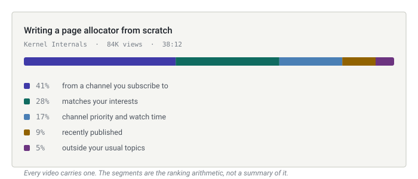

<div align="center">

<picture>
  <source media="(prefers-color-scheme: dark)" srcset="docs/assets/logo-dark.svg">
  
</picture>

<br>

**A programmable recommendation layer for [Invidious](https://github.com/iv-org/invidious).**

Allocate your feed by source. See why every video is there. Filter on scores the
system will show you the arithmetic for. Set per-channel priority from −5 to +5.
Ask a local model, in prose, for what you actually want.

[](https://github.com/yourname/sieve/actions/workflows/ci.yml)
[](pyproject.toml)
[](LICENSE)
[](requirements.txt)

[Install](docs/install.md) · [Configuration](docs/configuration.md) ·
[Rules](docs/rules.md) · [API](docs/api.md) · [CLI](docs/cli.md) ·
[Architecture](docs/architecture.md) · [Player](docs/player.md)

</div>

---

Conventional recommendation systems are opaque by construction and unopinionated
by design: they optimise for watch time and decline to explain themselves. Sieve
is the other thing. It is a control surface for people who would rather spend an
afternoon configuring a feed than be surprised by one, and its central rule is
that **nothing affects the ranking without saying so.**

```bash
git clone https://github.com/yourname/sieve && cd sieve
pip install -e .

sieve demo     # 400 synthetic videos, no instance needed
sieve serve    # http://127.0.0.1:8377
```

---

## Contents

- [Every video explains itself](#every-video-explains-itself)
- [How a homepage is built](#how-a-homepage-is-built)
- [What you can control](#what-you-can-control)
- [Not a fork](#not-a-fork)
- [Reused, and replaced](#reused-and-replaced)
- [Footprint](#footprint)
- [Privacy](#privacy)
- [Documentation](#documentation)
- [Contributing](#contributing)

---

## Every video explains itself

<div align="center">
<picture>
  <source media="(prefers-color-scheme: dark)" srcset="docs/assets/why-bar-dark.svg">
  
</picture>
</div>

The bar is the ranking arithmetic, not a summary of it. Open the video page and
each content score breaks down the same way, to the individual feature: *82 on
education, 31 points of it from citation links in the description.*

That is possible because the scores are linear models. Each feature's exact
contribution is free to compute, so there is no second model approximating the
first — which is the main reason this project does not use gradient boosting and
SHAP.

The debugger answers the other question, which is usually the more useful one:

> **Why videos were hidden**
>
> | Count | Reason | For example |
> |---|---|---|
> | 184 | already watched | |
> | 62 | shorter than 180s (Shorts filter) | POV: it's 3am · Ranking EVERY single one |
> | 41 | brainrot 71 is above your limit of 40 | SHOCKING moments that broke the internet |
> | 12 | 34% of the video is sponsor read | |
> | 8 | channel is on your block list | |

---

## How a homepage is built

<div align="center">
<picture>
  <source media="(prefers-color-scheme: dark)" srcset="docs/assets/pipeline-dark.svg">
  
</picture>
</div>

Every rejection is recorded with a reason rather than discarded. The whole pass
is pure SQLite — the network is never touched on the request path, which is why
the page still renders when your instance is down.

---

## What you can control

<details open>
<summary><b>Sources</b> — allocate the feed, and see the real shares</summary>

<br>

Six sliders: subscriptions, watch history, playlists, discovery, interests,
niche. The live percentage sits next to each one, because a weight that does not
read as a share is a weight nobody can reason about.

A separate novelty slider decides how far outside your interest centroid to
reach. Homepage modes go further: one playlist and nothing else, unfinished
videos only, subscriptions only, or pure random.

</details>

<details>
<summary><b>Channels</b> — priority, whitelist, blacklist, and what watch time implies</summary>

<br>

Four numbers per channel, kept deliberately apart:

| | What it is | Who sets it |
|---|---|---|
| **Priority** | −5 to +5. A standing instruction | you |
| **Listing** | allow, block, or neutral. Whitelist-only mode admits nothing else | you |
| **Affinity** | watch seconds weighted by completion, decayed on a half-life you choose, scaled against your most-watched channel | derived |
| **Quality** | the channel's own catalogue: education, density, topic consistency, minus bait | derived |

They live in separate columns and are reported separately in every explanation.
"I put this at +5" and "you apparently love this channel" are different claims,
and blending them is how feeds become unexplainable.

</details>

<details>
<summary><b>Scores</b> — twelve axes, each one a model you can read</summary>

<br>

education · entertainment · stimulation · brainrot · clickbait · information
density · technical depth · production · AI generation · adult content · music ·
profanity

Aim at a value, or set a hard cutoff. A target is an aim, not a threshold:
`production: 25` asks for rough, unpolished video and ranks a 90 down as hard as
a 5.

Two honest limits. *Excessive jump cuts* is in the brief and is not measured —
it needs decoded video, which is the cost this project declined to pay; the
proxies are runtime, meme vocabulary, Shorts tagging and title surface.
*Thumbnail sensationalism* is not measured from the image either: DeArrow's
crowd-voted corrections answer the same question with human judgement.

</details>

<details>
<summary><b>Filters and rules</b> — a programmable search engine, not a preference pane</summary>

<br>

Duration, views, subscriber count, upload age, like ratio, caption language, and
a cutoff on every score. Then a rule language for the rest, with live validation
and a preview of what it would keep and drop from your actual catalogue:

```json
{"all": [
  {"field": "technical_depth", "op": ">", "value": 65},
  {"field": "production", "op": "<", "value": 50},
  {"field": "subs", "op": "<", "value": 50000},
  {"field": "sponsor_ratio", "op": "<", "value": 0.15}
]}
```

**Filters that cannot see their data abstain.** No subscriber count means a
subscriber floor does not apply; no captions means a language filter does not.
The alternative is an empty homepage with no visible cause, which is the failure
this project exists to avoid. See the [cookbook](docs/rules.md#cookbook).

</details>

<details>
<summary><b>Anti-doomscroll</b> — composition budgets and rabbit-hole detection</summary>

<br>

Quotas per bucket ("no more than 10% memes"), absolute daily caps ("at most
three"), and a diversity control that trades relevance for variety.

Rabbit-hole detection measures normalised topic entropy across the rendered
page. When it collapses, the homepage says so and offers to widen things:

> Your homepage has narrowed: **62%** of it is about "cybersecurity", and topic
> diversity has dropped to 21%. &nbsp; `Raise novelty to 55`

</details>

<details>
<summary><b>Brief</b> — describe what you want, in prose</summary>

<br>

> Hard engineering projects with low production value made by people who clearly
> know what they are doing. No podcasts, nothing over an hour.

A local model compiles that into a settings patch, which you see as a diff
before it is applied. **The ranking itself never calls a model** — it compiles
preferences once and the deterministic engine does the work, so the homepage
stays fast and reproducible and a 7B model on a consumer GPU is plenty.

With no model configured, a keyword fallback keeps the box from being dead
weight. It is dumber and says so.

</details>

<details>
<summary><b>Learning</b> — richer signals than a thumbs-down</summary>

<br>

More like this · less like this · same topic but shorter · same topic but more
technical · same topic but better made. The structured ones edit your settings
directly, because "shorter" is a duration preference, not a label.

Completion is weighted: finishing a video and closing it after eight seconds are
opposite opinions, not the same click. The model is a logistic regression that
trains on the request thread and shows you its coefficients.

</details>

<details>
<summary><b>Playlists</b> — a homepage that is just your queue</summary>

<br>

Paste a playlist id or URL and it is imported; every sync keeps it current. Make
one playlist the entire homepage — the "100% Watch Later" setup — or raise the
playlists source to mix it in with everything else.

YouTube's own Watch Later is private to your Google account and Invidious cannot
read it, so keep a public or unlisted playlist on your Invidious account and use
that instead. Sieve says so rather than importing nothing.

</details>

<details>
<summary><b>An API for all of it</b> — anything you can click, you can script</summary>

<br>

Every feature in the web app has a JSON endpoint, and a test fails if the two
ever diverge. Switch moods from cron, keep your channel lists in git, or build a
different front end entirely.

```bash
curl -s localhost:8377/api/recommendations?limit=3 | jq '.items[] | {title, explanation}'
```

A running instance serves interactive docs at `/api/docs`; the overview is in
[docs/api.md](docs/api.md).

</details>

<details>
<summary><b>Profiles</b> — configurations as files</summary>

<br>

Export everything — settings, interests, channel policy — as one JSON document.
Import someone else's from a file or a URL. That is the "recommendation market"
without a market: a profile is a file, so a gist is already a distribution
channel.

Imported profiles go through the same whitelist as model output, because they
are exactly as untrusted.

</details>

---

## Not a fork

Sieve runs **alongside** an Invidious instance and reads from its public JSON
API. Three lines of nginx put it in front:

```nginx
location / {
    proxy_pass http://127.0.0.1:8377;   # Sieve owns the homepage
}
location ~ ^/(watch|embed|vi|api|channel|playlist|search|latest_version) {
    proxy_pass http://127.0.0.1:3000;   # Invidious owns everything else
}
```

Forking would mean maintaining ~100k lines of Crystal you did not write and
rebasing forever, to change something that does not need to live inside
Invidious. Upstream ships a new version tomorrow, you update it, nothing here
breaks.

The cost is real and worth naming: Sieve cannot change the player page, so
[watch-progress reporting](docs/player.md) is opt-in.

---

## Reused, and replaced

The brief asked not to reinvent wheels, and also to run on a consumer machine.
Those goals conflict more often than you would expect, because the standard tool
for a job is frequently a service designed for a fleet.

### Reused

| Need | Tool | Why |
|---|---|---|
| Catalogue, player, proxy | **Invidious API** | Already exists, already maintained, already what you are running |
| Honest titles | **[DeArrow](https://dearrow.ajay.app)** | Humans have already voted on which titles are lies. Guessing from capital letters is strictly worse than asking |
| Sponsor segments | **[SponsorBlock](https://sponsor.ajay.app)** | Same argument, used twice: to skip, and as a ranking signal — a video that is 40% ad read is a worse video |
| Transcripts | **Invidious captions** | They already exist upstream |
| Storage | **SQLite (WAL)** | One file, no daemon, readable with `sqlite3` |
| Web layer | **FastAPI + Jinja** | Server-rendered HTML, no build step |

Both community lookups use the published hash-prefix endpoints: Sieve sends the
first four characters of `sha256(videoID)` and gets back a bucket of a few
hundred videos, so the server never learns which one you wanted. It is also the
cheaper path, since one request covers many videos.

### Replaced

<details>
<summary>Eleven tools from the brief, and what replaced each</summary>

<br>

| Suggested | Used instead | Reason |
|---|---|---|
| PostgreSQL + Redis | SQLite | Two daemons, a pool and a cache-invalidation story, to serve one person |
| Qdrant / Weaviate / Chroma | Hashed TF-IDF vectors | A vector database earns its keep at millions of documents. At tens of thousands, cosine over a dict beats the network hop |
| BGE-M3 / Nomic embeddings | The same vectors, with a real backend one setting away | `embed.py` implements `hashed`, `ollama` and `openai` behind one interface, so the claim is testable rather than asserted. Dense vectors cost ~8× the bytes |
| Whisper / faster-whisper / Vosk | Invidious captions | Minutes of CPU per video, to reproduce a transcript that already exists |
| XGBoost / LightGBM / CatBoost | Online logistic regression | The training set is one person's feedback, arriving one row at a time. Boosting needs batches and cannot explain itself |
| SHAP / LIME | The model's own coefficients | A linear model's contribution is exact and free. An explainer approximating a model you chose to make opaque is a self-inflicted wound |
| spaCy | A tokenizer and some lexicons | We need word boundaries and stopwords, not dependency parsing |
| YAMNet / MusicNN | Metadata and lexicons | Audio classification to detect that a video filed under Music by a "- Topic" channel is music |
| NudeNet / OpenNSFW2 over frames | OpenNSFW2 over **thumbnails**, optional | Frame extraction means downloading video for every candidate. The thumbnail is already fetched and is the image being filtered |
| JSONLogic / CEL / OPA | ~120 lines, closed operator set | OPA is a Go daemon; cel-python pulls protobuf and ANTLR; json-logic-py permits arbitrary arithmetic in a file that can arrive from a stranger |
| Chart.js / ECharts / Recharts | Inline SVG | ~200 KB of JavaScript to draw seven bar charts |

</details>

The only things written from scratch are the orchestration, the ranking, the
explanation layer and the interface — which is what the brief asked for.

---

## Footprint

Raspberry Pi 4, roughly 20,000 videos catalogued:

| | |
|---|---|
| Idle memory | ~90 MB |
| Homepage render | 40–120 ms |
| Scoring | ~35 videos/s without transcripts, ~4/s with |
| Database | ~180 MB including transcripts |
| Runtime dependencies | 5 |
| GPU, second daemon, build step | none |

---

## Privacy

Everything is local. The only outbound requests are to your Invidious instance,
to `sponsor.ajay.app` by hash prefix if you enable DeArrow or SponsorBlock, and
to your own model endpoint if you configure one. No telemetry, nothing reported
anywhere, and the database is a file you can read.

> [!WARNING]
> Sieve has no authentication. It is a single-user tool that assumes whoever can
> reach it is you. Keep it behind a VPN, an SSH tunnel, or your reverse proxy's
> auth — not on the open internet.

---

## Documentation

| | |
|---|---|
| [Installation](docs/install.md) | Source, Docker, nginx, systemd, importing your data |
| [Configuration](docs/configuration.md) | Every deployment key and user setting |
| [Rules](docs/rules.md) | The rule language, field reference and cookbook |
| [HTTP API](docs/api.md) | Every endpoint — anything you can click, you can `curl` |
| [Command line](docs/cli.md) | Running and maintaining Sieve, with recipes |
| [Architecture](docs/architecture.md) | Why it is built this way |
| [Player integration](docs/player.md) | Watch progress and SponsorBlock skipping |
| [Contributing](CONTRIBUTING.md) | How to propose a change |

---

## Contributing

Bug reports, rule cookbook entries and shared profiles are all welcome. Two
constraints shape what gets merged: it has to run on a single consumer machine,
and it has to be explainable to the person using it. See
[CONTRIBUTING.md](CONTRIBUTING.md).

```bash
pip install -e '.[dev]'
ruff check . && pytest -q
```

## Licence

[AGPL-3.0-or-later](LICENSE), matching Invidious. SponsorBlock and DeArrow data
is used under CC BY-NC-SA 4.0.
