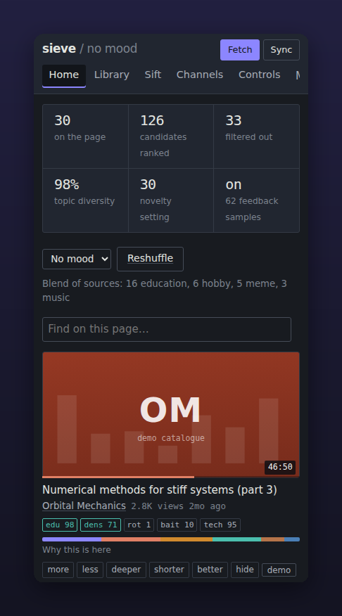

# Sieve for Android

The whole of Sieve, on your phone — or a window onto the Sieve you run at home.

## Get it

| Way | Steps |
|---|---|
| **Download** | Open the [latest release](https://github.com/whereixuezugi/sieve/releases/latest), download `sieve-android.apk`, open it on your phone. Android asks once to allow installing from your browser or file manager. |
| **Build your own, on GitHub** | Fork this repository → **Actions** tab → **Android APK** → **Run workflow**. About ten minutes later, open the run and download **sieve-android** from *Artifacts*. No tools on your computer needed. |
| **Build on your computer** | JDK 17, the Android SDK (Android Studio installs both), Gradle 8.7+, and Python 3.11 on the PATH: `cd android && gradle assembleRelease` `adb install app/build/outputs/apk/release/app-release.apk` |

To publish a release yourself: `git tag v0.7.0 && git push --tags`. The workflow builds
the APK and attaches it to the release as `sieve-android.apk`.

No install at all? Open Sieve in your phone's browser and choose **Add to Home screen**.

## First launch

Choose where Sieve runs — you can switch later from the menu:

- **On this phone.** Sieve runs inside the app; everything stays on the phone. A quiet
  notification shows while it works, so syncs and downloads carry on with the screen off.
  The first start unpacks Python and takes up to a minute.
- **On my server.** A window onto your home Sieve — `http://192.168.1.20:8377`, say — with
  its history and settings.

## On the phone

- **Share → Sieve** from YouTube or a browser sifts the link.
- **Downloads** for offline viewing work without ffmpeg; they seek and jump to chapters.
- **Imports and uploads** (subscriptions, history, profiles, YouTube cookies) open the phone's file picker.
- **Notifications**: point Controls → Notifications at [ntfy](https://ntfy.sh) and install its app.
- **If YouTube asks Sieve to sign in**, upload a cookies.txt under Controls → Source.

## How it is built

The app is a small Kotlin shell around a WebView. The Python package in `../sieve` —
the same code as the desktop server — is copied in at build time and run with
[Chaquopy](https://chaquo.com/chaquopy/), so the phone never lags behind the server.

Dependencies are pure Python (`app/requirements-android.txt`: pydantic 1, plain uvicorn),
because nothing can be compiled for the phone at build time. The workflow's first job runs
the full test suite on exactly that set; only then does it build.

## Limits

- **Background time**: Android limits how long an app works in the background (about six
  hours a day on Android 15). A sync that stops resumes when you open the app.
- **Storage**: the database, backups and downloads live in the app's private storage and
  are deleted with it. Export notes from the Library; download backups from Controls.
- **Signing**: CI builds use a debug key so they install directly. For anything you
  distribute, add your own `signingConfig` in `app/build.gradle.kts`.

> [!NOTE]
> This project was written where Google's build servers were unreachable, so the APK build
> itself was first run by GitHub Actions, not locally. Everything Python is tested on the
> phone's exact dependency set. If a build fails, the run's log names the line.
